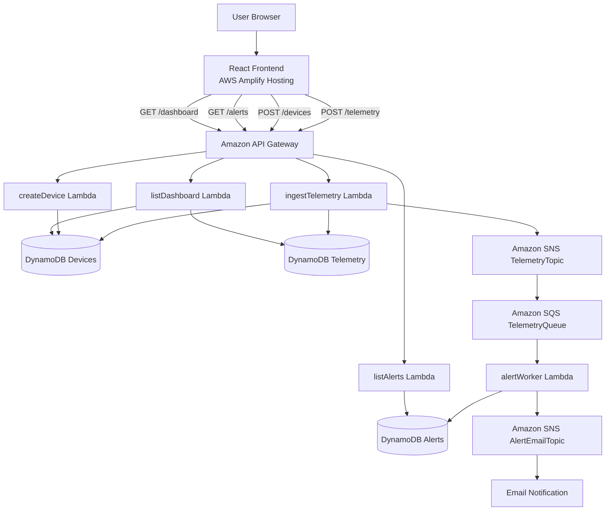

# IoT Cloud Monitoring Platform
Devices are added as well as their telemetry
Later this are monitored and in case of emergency a message is received.

## Architecture

```mermaid
flowchart TD
    U[User Browser] --> F[React Frontend<br/>AWS Amplify Hosting]

    F -->|GET /dashboard| APIGW[Amazon API Gateway]
    F -->|GET /alerts| APIGW
    F -->|POST /devices| APIGW
    F -->|POST /telemetry| APIGW

    APIGW --> LD[listDashboard Lambda]
    APIGW --> LA[listAlerts Lambda]
    APIGW --> CD[createDevice Lambda]
    APIGW --> IT[ingestTelemetry Lambda]

    LD --> DDB1[(DynamoDB Devices)]
    LD --> DDB2[(DynamoDB Telemetry)]

    LA --> DDB3[(DynamoDB Alerts)]

    CD --> DDB1

    IT --> DDB2
    IT --> DDB1
    IT --> SNS1[Amazon SNS TelemetryTopic]

    SNS1 --> SQS[Amazon SQS TelemetryQueue]
    SQS --> AW[alertWorker Lambda]

    AW --> DDB3
    AW --> SNS2[Amazon SNS AlertEmailTopic]
    SNS2 --> EMAIL[Email Notification]
```
